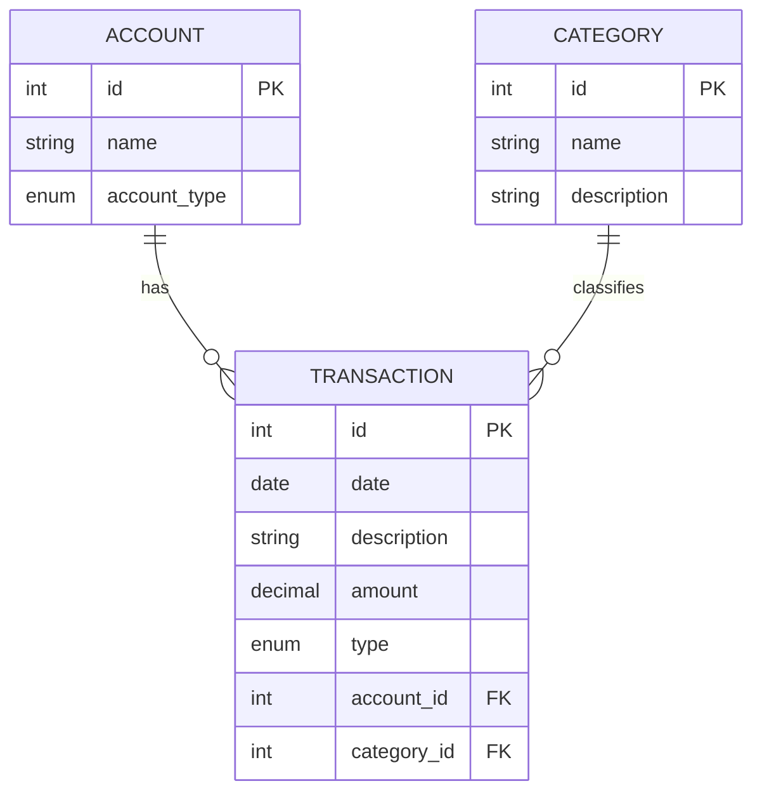

# Data Modeling Documentation

- This document explains the database structure and design decisions made in `models.py`. 
- **This markdown file was use to learn and document the data modeling concepts used in this project.**

## Technologies

The file uses **SQLModel**, which combines two well-established Python libraries:

- **SQLAlchemy**: Python's most popular ORM (Object Relational Mapper). It maps Python classes to SQL tables.
- **Pydantic**: The industry standard for data validation in Python.

---

## Core Concepts

### Classes as Tables

Any class that inherits from `SQLModel` with `table=True` becomes a table in PostgreSQL.

- Python: `class Transaction(...)`
- SQL: `CREATE TABLE transaction (...)`

### Enums

We use `Enum` for fields with a fixed set of valid options. This prevents inconsistent data in the database—for example, avoiding situations where one transaction is saved as "Income", another as "income", and another as "revenue".

`TransactionType` only accepts `INCOME`, `EXPENSE`, or `TRANSFER`.

### Decimal vs Float

For the `amount` field, we use `Decimal` instead of `float`. Floating-point numbers have precision issues when representing decimal fractions in binary. For example, `0.1 + 0.2` might return `0.30000000000000004`. The `Decimal` type provides exact mathematical precision, which is essential for financial systems.

---

## Model Details

### Account

Represents where money is stored (e.g., checking account, wallet, investments).

- `id`: Unique identifier in the database.
- `name`: Account name (indexed for faster queries).
- `account_type`: Defines whether it's checking, savings, credit, cash, or investment. We use `account_type` instead of `type` because `type` is a reserved word in Python.
- Relationship: One account has many transactions.

### Category

Represents how a transaction is classified (e.g., Food, Transportation, Entertainment).

- `id`: Unique identifier.
- `name`: Category name (indexed for faster queries).
- `description`: Optional field for additional details.
- Relationship: One category has many transactions.

### Transaction

The main table that records money flow. It connects accounts and categories.

- `date`: When the transaction occurred.
- `description`: A brief note about the transaction.
- `amount`: The transaction value (must be positive).
- `type`: Whether it's income, expense, or transfer.

**Foreign Keys:**
- `account_id`: Links to the `Account` table—identifies which account was used.
- `category_id`: Links to the `Category` table—identifies what type of transaction it is.

**Validation (Pydantic):**
- `validate_positive_amount`: Rejects negative values or zero before saving.
- `validate_description`: Rejects empty or whitespace-only descriptions.

---

## Understanding Relationships

SQLModel uses two concepts to link tables:

**Foreign Key (`foreign_key`)**

This is the actual column stored in the database (e.g., `account_id = 1`). It's just an integer that references another table.

**Relationship Object (`Relationship`)**

This is where the ORM does its work. When you access `my_transaction.account`, Python automatically queries the database and returns the full `Account` object associated with that ID.

The `back_populates` parameter creates a two-way connection:
- `Transaction.account` returns the account for that transaction.
- `Account.transactions` returns all transactions for that account.

---

## Entity Relationship Diagram

